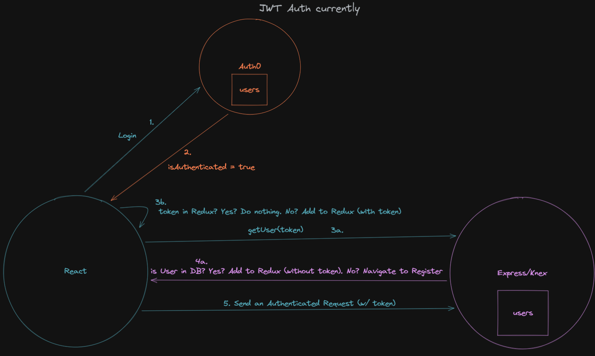
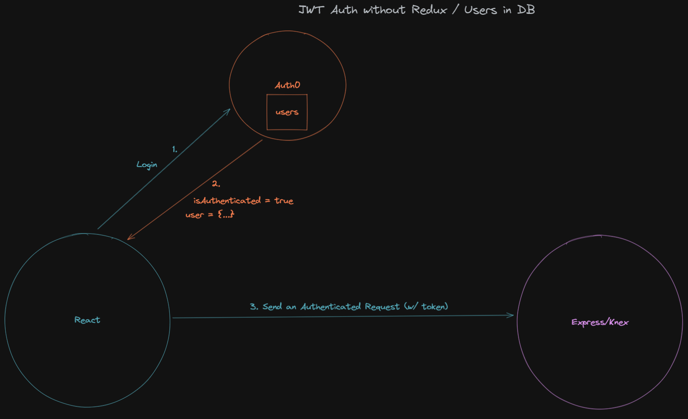

# JWT Auth Challenge Migration Guide

This is a quick guide to help shift your mindset from this model:



To this model:


---

## What's changed?

### App.jsx
Starting from `client/components/App.jsx`

Old:
```jsx
// client/components/App.jsx
function App() {
  // step 3b: add the user and token to redux
  cacheUser()

  const { isAuthenticated } = useAuth0()
  const user = useSelector(state => state.loggedInUser)

  useEffect(() => {
    // step 3a and 4a
    if (!isAuthenticated) {
      // ... clear user from redux
    } else {
      // ... get user from database
      // ... add them to redux or navigate to register
    }
  }, [isAuthenticated])

  return ({/* ... */})
}
```

New:
```jsx
// client/components/App.jsx
function App() {
  const { user } = useAuth0()

  // ... use user from Auth0 instead of doing anything else here
}
```

Much of the code in the previous example was there to handle the case where a user was logged in (and registered in the eyes of Auth0) but not registered in our local database. Since Auth0 has its own database of users, we can remove ours and use theirs.

### Fetching Authenticated Data
Old:
```jsx
function MyPosts() {
  const token = useSelector((state) => state.loggedInUser.token)

  useEffect(() => {
    // we may want to check the user is authenticated also
    if (token) {
      fetchPosts(token)
        .then(/* ... */)
    }
  }, [])

  return (/* ... */)
}
```

New:
```jsx
function MyPosts() {
  const { isAuthenticated, getAccessTokenSilently } = useAuth0()

  useEffect(() => {
    // you can check they're authenticated here, or by protecting the route
    // with withAuthenticationRequired HOC
    if (isAuthenticated) {
      getAccessTokenSilently()
        .then((token) => {
          return fetchPosts(token)
        })
        .then(/* ... */)
    }
  })

  return (/* ... */)
}
```

### Protecting Server Routes

Protecting server-side routes with `checkJwt` is performed exactly the same and isn't affected by these changes!

### User API Routes

There are two routes that shipped with jwt-auth that are no longer needed:

- `GET /api/v1/users` - this was used to get all the users in the database. We can instead use the Auth0 Management API to get that information straight from them.
- `POST /api/v1/users` - since we don't keep a local database of users, we don't need this route.

### Fetching User Data from the Management API

> TODO: update this section with relevant code examples that fit the context of `jwt-auth`

To join user information with some piece of data (say, a fruit) we would join the `users` table with the `fruits` table. Without a `users` table, we can instead fetch the fruit (with the `added_by_user` column) and fetch the user information from Auth0.

A request to `${apiManagementUrl}/api/v2/users/${addedByUser}` would be an example request of this.